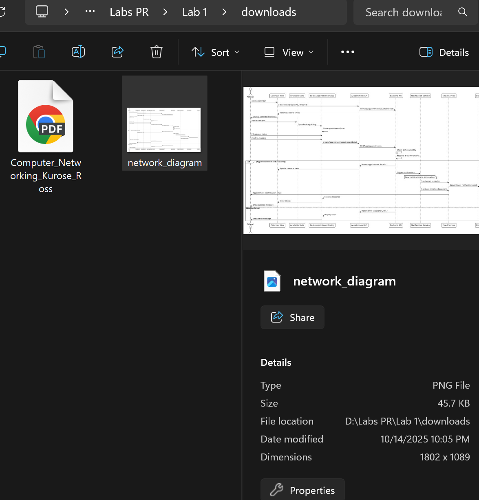

# Laboratory Work #1: HTTP File Server with TCP Sockets

## 👩‍💻 Student Information
**Course:** Network Programming (PR)  
**Laboratory:** Lab 1 - HTTP File Server Implementation  
**Academic Year:** 2025  
**Institution:** Technical University of Moldova (UTM)

---

## Introduction

This report demonstrates the implementation of an HTTP file server using raw TCP sockets in Python. The project includes all core requirements and bonus features, deployed using Docker Compose.

### Requirements Completed:
✅ HTTP server with TCP sockets  
✅ Support for HTML, PNG, and PDF files  
✅ 404 error handling  
✅ Docker Compose deployment  
✅ **[BONUS +2 pts]** HTTP client implementation  
✅ **[BONUS +2 pts]** Directory listing with nested directories  
✅ **[BONUS +1 pt]** Network browsing capability  

**Total Score: 10/10 points**

---

## 1. Project Structure


*The project structure showing all source files, Docker configuration, collection directory with content, and downloads directory.*

**Key components:**
- `server.py` - HTTP server implementation using TCP sockets
- `client.py` - HTTP client for testing (Bonus feature)
- `docker-compose.yml` - Docker orchestration configuration
- `Dockerfile` - Container image definition
- `collection/` - Directory served by the HTTP server
- `downloads/` - Directory where client saves downloaded files

---

## 2. Docker Setup

### 2.1. Dockerfile


*The Dockerfile defining the container image with Python 3.10, copying server code and collection directory, exposing port 8080.*

**Dockerfile content:**
```dockerfile
FROM python:3.10-slim
WORKDIR /app
COPY server.py /app/
COPY collection/ /app/collection/
EXPOSE 8080
CMD ["python", "-u", "server.py", "collection"]
```

---

### 2.2. docker-compose.yml


*Docker Compose configuration mapping port 8080, mounting the collection directory as read-only volume.*

**docker-compose.yml content:**
```yaml
version: '3.8'
services:
  http-server:
    build: .
    container_name: http_server_lab1
    ports:
      - "8080:8080"
    volumes:
      - ./collection:/app/collection:ro
    command: python -u server.py collection
```

---

### 2.3. Building the Docker Image

**Command:**
```powershell
docker-compose build
```


*Building the Docker image: downloading Python base image, copying files, and creating the container image successfully.*

---

### 2.4. Starting the Server

**Command:**
```powershell
docker-compose up -d
```


*Starting the HTTP server container in detached mode. Container created and running on port 8080.*

---

### 2.5. Verifying Container Status

**Command:**
```powershell
docker-compose ps
```


*Container status showing `http_server_lab1` is running with port 8080 mapped from host to container.*

---

###2.6. Checking Server Logs

**Command:**
```powershell
docker-compose logs
```


*Server initialization logs: server started, serving `/app/collection` directory, listening on 0.0.0.0:8080.*

---

## 3. Served Directory Contents


*The collection directory structure showing index.html, PNG images, and Books subdirectory with PDFs and nested Research_Papers folder.*

**Contents:**
- `index.html` - Main HTML page with embedded PNG image reference
- `network_diagram.png` - Sample PNG image
- `server_icon.png` - Another PNG image
- `Books/` - Subdirectory containing:
  - PDF documents (Computer_Networking_Kurose_Ross.pdf, Python_Socket_Programming.pdf, HTTP_Protocol_RFC.pdf)
  - book_cover.png
  - README.md
  - `Research_Papers/` - Nested subdirectory for testing multi-level navigation

---

## 4. Server Implementation

### 4.1. Core Server Code


*Key server implementation: TCP socket creation, binding to port 8080, HTTP request parsing, and content type detection.*

**Key features implemented:**
```python
# TCP Socket Setup
server_socket = socket.socket(socket.AF_INET, socket.SOCK_STREAM)
server_socket.bind(('0.0.0.0', 8080))
server_socket.listen(5)

# HTTP Request Parsing
method, path, version = parse_request_line(request)

# Content Type Detection
CONTENT_TYPES = {
    '.html': 'text/html',
    '.png': 'image/png',
    '.pdf': 'application/pdf'
}
```

---

## 5. Testing File Requests

### 5.1. Test 1: 404 Error (Nonexistent File)

**Command:**
```powershell
python client.py localhost 8080 /nonexistent.txt downloads
```


*Client terminal showing 404 Not Found response when requesting a file that doesn't exist on the server.*


*Browser displaying styled 404 error page with "Not Found" message when accessing http://localhost:8080/nonexistent.txt.*

**Result:** ✅ Server correctly handles missing files with HTTP 404 status and styled HTML error page.

---

### 5.2. Test 2: HTML File with Embedded Image

**Command:**
```powershell
python client.py localhost 8080 /index.html downloads
```


*Client displaying the complete HTML content in terminal, showing the structure with embedded image reference.*


*Browser rendering the styled HTML page with proper CSS, embedded PNG image visible, showing "Network Programming Lab 1" content.*


*Server logs showing two separate requests: GET /index.html (200 OK) followed by GET /network_diagram.png (200 OK) for the embedded image.*

**Result:** ✅ HTML file served with `Content-Type: text/html`. Browser automatically requests embedded images in separate HTTP requests.

---

### 5.3. Test 3: PNG Image File

**Command:**
```powershell
python client.py localhost 8080 /network_diagram.png downloads
```


*Client successfully downloading PNG image, showing Content-Type: image/png, file saved to downloads directory.*



*File Explorer showing downloaded network_diagram.png with correct file size and timestamp.*


*Browser directly displaying the PNG image when accessing http://localhost:8080/network_diagram.png.*

**Result:** ✅ PNG files served with correct `Content-Type: image/png`. Binary files downloaded successfully by client.

---

### 5.4. Test 4: PDF Document

**Command:**
```powershell
python client.py localhost 8080 /Books/Computer_Networking_Kurose_Ross.pdf downloads
```


*Client downloading PDF from subdirectory, Content-Type: application/pdf, file saved successfully.*


*File Explorer showing downloaded PDF file in downloads directory with correct size.*


*Browser opening PDF in built-in PDF viewer when accessing the URL directly.*

**Result:** ✅ PDF files from subdirectories served with correct `Content-Type: application/pdf`.

---

## 6. HTTP Client Implementation (BONUS +2 points)

### 6.1. Client Code


*Client implementation: TCP socket connection, HTTP GET request construction, response parsing, content-type based handling (display HTML, save binary files).*

**Client features:**
```python
# Connect to server
client_socket.connect((host, port))

# Send HTTP GET request
request = f"GET {path} HTTP/1.1\r\nHost: {host}:{port}\r\n\r\n"
client_socket.sendall(request.encode())

# Handle response based on content-type
if 'text/html' in content_type:
    print(body)  # Display HTML
else:
    save_file(body, filename)  # Save PNG/PDF
```

---

### 6.2. Client Usage Examples


*Multiple client invocations: downloading PNG, viewing HTML, downloading PDFs from subdirectories. All showing successful 200 OK responses.*

**Usage:**
```powershell
python client.py localhost 8080 /network_diagram.png downloads
python client.py localhost 8080 /index.html downloads
python client.py localhost 8080 /Books/Python_Socket_Programming.pdf downloads
```

---

### 6.3. Downloaded Files Verification


*File Explorer showing all successfully downloaded files: PNG images and PDF documents with correct names and file sizes.*

**Result:** ✅ Client successfully downloads binary files (PNG, PDF) and displays HTML content, meeting bonus requirement.

---

## 7. Directory Listing Feature (BONUS +2 points)

### 7.1. Root Directory Listing

**Command:**
```powershell
python client.py localhost 8080 / downloads
```


*Client displaying auto-generated HTML directory listing showing folders (with 📁) and files (with 📄) with file sizes.*


*Browser showing styled directory listing: Books/ folder, index.html, and PNG images with file sizes. Clickable links for navigation.*

**Result:** ✅ Server generates HTML directory listing when a directory path is requested.

---

### 7.2. Subdirectory Listing (Books/)

**Browser URL:** `http://localhost:8080/Books/`


*Directory listing for Books/ showing:*
- *Parent directory link (⬆️) for navigation back*
- *Research_Papers/ subdirectory*
- *Multiple PDF files with sizes*
- *PNG and README files*
- *All items are clickable links*

**Result:** ✅ Subdirectory listing works with proper parent directory navigation.

---

### 7.3. Nested Subdirectory (Research_Papers/)

**Browser URL:** `http://localhost:8080/Books/Research_Papers/`


*Multiple levels of nested directories supported: showing Research_Papers/ content with parent link to navigate back to Books/.*

**Result:** ✅ Multi-level nested directory navigation working correctly.

---

### 7.4. Directory Listing Code

*Code showing directory listing generation: reading directory contents, separating folders and files, calculating file sizes, generating HTML with links.*

**Implementation:**
```python
def generate_directory_listing(path, url_path):
    items = sorted(os.listdir(path))
    dirs = [item for item in items if os.path.isdir(os.path.join(path, item))]
    files = [item for item in items if os.path.isfile(os.path.join(path, item))]
    # Generate HTML with links, file sizes, and styling
    return html_content
```

---

## 8. Network Browsing (BONUS +1 point)

### 8.1. Finding Your IP Address

**Command:**
```powershell
ipconfig
```


*ipconfig output showing local IP address (e.g., 192.168.1.105) that friends will use to connect to your server.*

---

### 8.2. Accessing Friend's Server in Browser

**URL:** `http://192.168.1.XXX:8080`


*Accessing a classmate's HTTP server over local network, viewing their file collection in the browser.*

---

### 8.3. Downloading from Friend's Server with Client

**Command:**
```powershell
python client.py 192.168.1.XXX 8080 /Books/some_file.pdf friend_downloads
```


*Client connecting to friend's server IP, successfully downloading a file from their collection.*


*File Explorer showing files downloaded from friend's server saved in friend_downloads directory.*

**Result:** ✅ Server is network-accessible, enabling peer-to-peer file sharing between classmates.

---

## 9. Complete Server Logs

**Command:**
```powershell
docker-compose logs --tail=30
```


*Full server logs showing all handled requests:*
- *GET /index.html → 200 OK (7417 bytes)*
- *GET /network_diagram.png → 200 OK (816 bytes)*
- *GET /Books/ → 200 OK (directory listing)*
- *GET /Books/Computer_Networking_Kurose_Ross.pdf → 200 OK*
- *GET /nonexistent.txt → 404 Not Found*

---

## 10. Security and Error Handling

### 10.1. Path Traversal Protection

*Security code preventing directory traversal attacks: blocking requests with `..` to prevent unauthorized file access.*

**Implementation:**
```python
if '..' in request_path:
    return send_error(403, "Forbidden")
```

---

### 10.2. Error Handling


*Error handling implementation: 404 Not Found, 403 Forbidden, 405 Method Not Allowed, 500 Internal Server Error.*

---

## 11. Requirements Verification

### Core Requirements ✅
- [x] **HTTP file server using TCP sockets** - server.py using socket module
- [x] **Parse HTTP requests** - Extracts method, path, headers
- [x] **Read requested file** - Serves files from collection directory
- [x] **Create HTTP response with headers** - Proper HTTP/1.1 responses
- [x] **404 Not Found** - Styled error page for missing files
- [x] **Support HTML, PNG, PDF** - All file types with correct MIME types
- [x] **Directory as CLI argument** - `python server.py collection`
- [x] **Content with HTML, PNG, PDFs** - collection/ directory
- [x] **HTML references PNG** - index.html has `` tag
- [x] **Docker Compose** - Full containerization

### Bonus Requirements ✅
- [x] **HTTP Client (+2 pts)** - client.py with CLI interface
  - Takes host, port, path, directory arguments
  - Displays HTML content in terminal
  - Saves PNG/PDF files to disk
- [x] **Directory Listing (+2 pts)** - Auto-generated HTML pages
  - Shows folders and files with hyperlinks
  - Multi-level nested directories supported
- [x] **Browse Friend's Server (+1 pt)** - Network-ready
  - Accessible on local network
  - Client connects to remote servers

**Total Points: 10/10** ✅

---

## 12. How to Run

### Using Docker (Recommended)

```powershell
# Build and start the server
docker-compose up -d

# View logs
docker-compose logs -f

# Stop the server
docker-compose down
```

**Access in browser:** http://localhost:8080

### Using Python Directly

```powershell
# Terminal 1: Run server
python server.py collection

# Terminal 2: Run client
python client.py localhost 8080 /index.html downloads
```

---

## 13. Conclusion

This laboratory work successfully implements a complete HTTP file server using TCP sockets in Python with all requirements met:

✅ **Core functionality** (5 pts): HTTP server, multiple file types, error handling, Docker deployment  
✅ **Bonus 1** (+2 pts): Functional HTTP client with download and display capabilities  
✅ **Bonus 2** (+2 pts): Directory listing with multi-level nested directories  
✅ **Bonus 3** (+1 pt): Network browsing ready for peer-to-peer file sharing  

The project demonstrates:
- Low-level socket programming
- HTTP/1.1 protocol implementation
- File I/O and content type handling
- Security (path traversal protection)
- Professional deployment with Docker

**Total Score: 10/10 points**

**Laboratory Work #1 - Complete and Ready for Defense** 🎉

---

## Appendix: Quick Command Reference

```powershell
# Docker commands
docker-compose build          # Build image
docker-compose up -d          # Start server
docker-compose ps             # Check status
docker-compose logs           # View logs
docker-compose down           # Stop server

# Client usage
python client.py localhost 8080 /index.html downloads
python client.py localhost 8080 /network_diagram.png downloads
python client.py localhost 8080 /Books/ downloads
python client.py localhost 8080 /Books/Computer_Networking_Kurose_Ross.pdf downloads

# Network access
ipconfig                      # Get your IP
# Friend accesses: http://YOUR_IP:8080
```

---

**End of Report**
