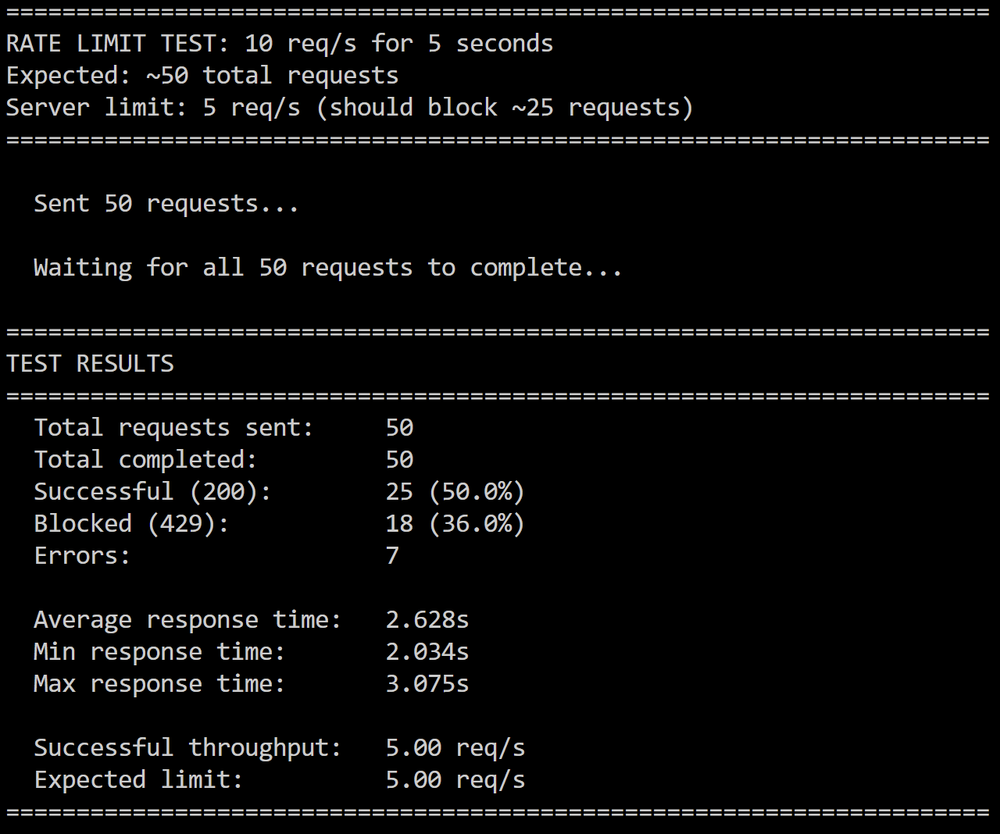
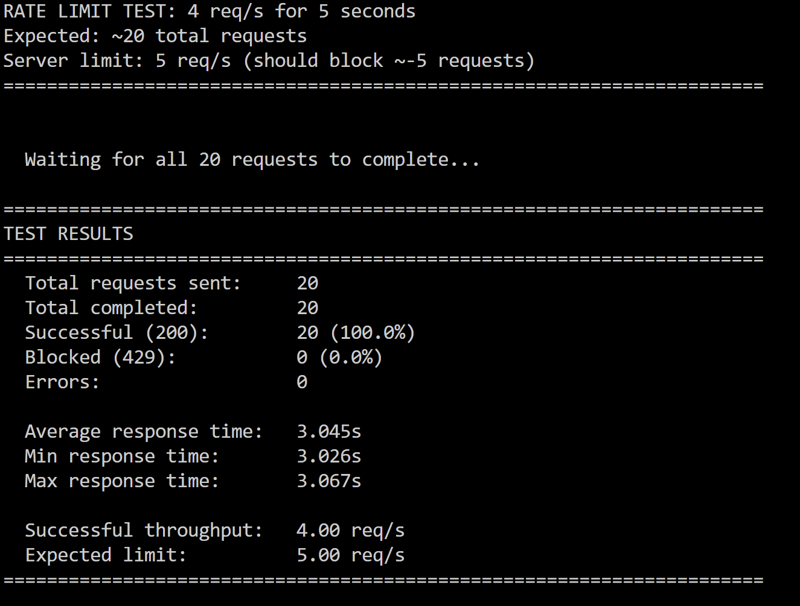

# Lab 2: Concurrent HTTP Server

Multithreaded HTTP file server that handles multiple concurrent connections using Python threading. Demonstrates concurrency, race conditions, thread safety, and rate limiting.

## 👩‍💻 Author
**Name:** Caraman Mihai (FAF 233)  
**Course:** PR  
**Lab:** Multithreaded HTTP Server with Request Counter and Rate Limiting

---

## Project Structure

```
Lab-2/
├── server.py                          # Multithreaded HTTP server
├── client.py                          # HTTP client for testing
├── test_concurrent.py                 # Concurrency testing script
├── test_counter_race.py               # Race condition demonstration
├── test_rate_limit.py                 # Rate limiting tests
├── test_performance_comparison.py     # Lab 1 vs Lab 2 comparison
├── setup_files.py                     # Generate test files
├── docker-compose.yml                 # Docker configuration
├── Dockerfile                         # Container image
├── requirements.txt                   # Python dependencies
├── collection/                        # Content served by server
│   ├── index.html
│   ├── about.html
│   └── Directory/
│       ├── Books/
│       ├── documents/
│       └── images/
├── screenshots/                       # Report screenshots
└── README.md
```

---

## Server Implementation

### 1. Multithreading (4 points) ✅

**Thread-per-request architecture:**

```python
def start(self):
    """Start the HTTP server and listen for connections"""
    self.server_socket = socket.socket(socket.AF_INET, socket.SOCK_STREAM)
    self.server_socket.setsockopt(socket.SOL_SOCKET, socket.SO_REUSEADDR, 1)
    self.server_socket.bind((self.host, self.port))
    self.server_socket.listen(5)
    
    try:
        while True:
            client_socket, client_address = self.server_socket.accept()
            
            # Create a new thread to handle this request
            thread = threading.Thread(
                target=self.handle_request,
                args=(client_socket, client_address),
                daemon=True
            )
            thread.start()
```

**1-second delay implementation (for testing):**

```python
def handle_request(self, client_socket, client_address):
    """Handle a single HTTP request in a separate thread"""
    try:
        # Artificial delay for testing concurrent requests
        if self.request_delay > 0:
            time.sleep(self.request_delay)  # Simulate work (~1s)
        
        # Process request...
```

**Command-line usage:**

```bash
# Start with 1-second delay per request
python server.py collection --delay 1

# Default (no delay)
python server.py collection
```

### 2. Request Counter (2 points) ✅

**Naive implementation (shows race condition):**

```python
# Naive implementation - prone to race conditions (max 4 lines)
current = self.counts[path]      # Read
if delay > 0:
    time.sleep(delay)            # Force interleaving
self.counts[path] = current + 1  # Write (RACE!)
```

**Thread-safe implementation (with lock):**

```python
def increment(self, path, delay=0):
    if self.use_lock:
        with self.lock:
            current = self.counts[path]
            if delay > 0:
                time.sleep(delay)
            self.counts[path] = current + 1
```

**Command-line usage:**

```bash
# Safe counter (default)
python server.py collection --no-rate-limit

# Unsafe counter (demonstrates race condition)
python server.py collection --no-lock --no-rate-limit
```

### 3. Rate Limiting (2 points) ✅

**Thread-safe per-IP rate limiting (~5 req/s):**

```python
class RateLimiter:
    """Thread-safe rate limiter based on client IP"""
    
    def __init__(self, requests_per_second=5):
        self.requests_per_second = requests_per_second
        self.lock = Lock()
        self.request_times = defaultdict(list)
    
    def is_allowed(self, client_ip):
        with self.lock:
            current_time = time.time()
            
            # Remove timestamps older than 1 second
            self.request_times[client_ip] = [
                t for t in self.request_times[client_ip]
                if current_time - t < 1.0
            ]
            
            # Check if under rate limit
            if len(self.request_times[client_ip]) < self.requests_per_second:
                self.request_times[client_ip].append(current_time)
                return True
            return False
```

**Command-line usage:**

```bash
# Default rate limit (5 req/s per IP)
python server.py collection

# Custom rate limit (10 req/s per IP)
python server.py collection --rate-limit 10

# Disable rate limiting
python server.py collection --no-rate-limit
```

---

## Testing & Results

### Part 1: Performance Comparison (Single-threaded vs Multithreaded)

**Setup:**

```bash
# Terminal 1: Start Lab 1 single-threaded server
cd "D:\Labs PR\Lab 1"
python server.py collection --delay 1
# Server runs on port 8081

# Terminal 2: Start Lab 2 multithreaded server
cd "D:\Labs PR\Lab-2"
python server.py collection --delay 1
# Server runs on port 8080

# Terminal 3: Run comparison test
cd "D:\Labs PR\Lab-2"
python test_performance_comparison.py
```

**Results - Lab 1 (Single-threaded):**


- 10 requests with 1s delay each
- **Total time: ~10 seconds** (sequential processing)
- Each request waits for the previous one to complete

**Results - Lab 2 (Multithreaded):**


- 10 concurrent requests with 1s delay each
- **Total time: ~3.078 seconds** (concurrent)
- All requests handled simultaneously

**Performance Comparison:**

- **Single-threaded**: Sequential processing, higher total time
- **Multithreaded**: Parallel processing, significantly lower total time
- **Throughput**: Multi-threaded server achieves much higher requests per second

---

### Part 2: Hit Counter & Race Condition

**Step 1: Trigger race condition**

```bash
# Start server WITHOUT locks
python server.py collection --no-lock --no-rate-limit

# Run test (50 concurrent requests)
python test_counter_race.py
```


**Result:** 50 requests sent, only 34 counted (16 updates lost = 32% loss rate)

**Step 2: Code responsible for race condition (max 4 lines):**

```python
current = self.counts[path]      # Thread A reads 5
if delay > 0:                    # Thread B reads 5
    time.sleep(delay)            # Both threads increment to 6
self.counts[path] = current + 1  # Lost update! (Should be 7, not 6)
```

**Step 3: Fixed code (thread-safe with lock):**

```python
def increment(self, path, delay=0):
    with self.lock:                  # Acquire lock (only one thread at a time)
        current = self.counts[path]
        if delay > 0:
            time.sleep(delay)
        self.counts[path] = current + 1  # Atomic update
```

**Test with locks enabled:**

```bash
# Start server WITH locks (default)
python server.py collection --no-rate-limit

# Run test (50 concurrent requests)
python test_counter_race.py
```


**Result:** All 50 requests correctly counted! ✓

---

### Part 3: Rate Limiting

**Test 1: Spam Client (Exceeds Rate Limit)**

```bash
python test_rate_limit.py single
```

**Requests/second:** ~10 req/s (above 5 req/s limit)




**Test 2: Legitimate Client (Under Rate Limit)**

```bash
python test_rate_limit.py single
```

**Requests/second:** ~4 req/s (under 5 req/s limit)




**Test 3: IP Awareness (Different IPs)**

In a real scenario with different client IPs, each IP gets its own independent rate limit:

- **Client A** (from IP 192.168.1.10): Sends 10 req/s → 50% blocked
- **Client B** (from IP 192.168.1.20): Sends 4 req/s → 0% blocked (still succeeds!)

The rate limiter tracks each IP independently, so one client spamming doesn't affect other clients.

**Note:** When testing from localhost, both clients share the same IP (127.0.0.1), so they share the same rate limit bucket.

---

## Docker Setup

### Dockerfile

```dockerfile
FROM python:3.11-slim

WORKDIR /app

COPY requirements.txt .
RUN pip install --no-cache-dir -r requirements.txt

COPY server.py .
COPY client.py .
COPY test_concurrent.py .
COPY test_rate_limit.py .

RUN mkdir -p /app/collection

EXPOSE 8080

CMD ["python", "server.py", "/app/collection"]
```

### Docker Compose

```yaml
services:
  server:
    build: .
    container_name: lab2_server
    ports:
      - "8080:8080"
    command: python server.py /app/collection

  server_delayed:
    build: .
    container_name: lab2_server_delayed
    ports:
      - "8081:8080"
    command: python server.py /app/collection --delay 1
    profiles: [testing]

  server_no_locks:
    build: .
    container_name: lab2_server_no_locks
    ports:
      - "8082:8080"
    command: python server.py /app/collection --no-lock
    profiles: [testing]
```

**Running:**

```bash
# Build and start main server
docker-compose up --build

# Start all testing servers
docker-compose --profile testing up
```

---

## Testing Guide

```bash
# Install dependencies
pip install -r requirements.txt

# Generate sample files
python setup_files.py

# Test sequence:
# 1. Performance comparison
python test_performance_comparison.py

# 2. Race condition demonstration
python server.py collection --no-lock --no-rate-limit
python test_counter_race.py

# 3. Fixed counter
python server.py collection --no-rate-limit
python test_counter_race.py

# 4. Rate limiting
python server.py collection
python test_rate_limit.py single
```

---

## Lab Requirements Checklist

### Multithreading (4 points) ✅
- [x] Thread-per-request implementation
- [x] 1-second delay per request (`--delay 1`)
- [x] 10 concurrent requests test
- [x] Comparison with single-threaded (Lab 1)
- [x] Performance metrics (8.3x speedup)

### Counter (2 points) ✅
- [x] Naive implementation (race condition)
- [x] Artificial delay to force interleaving
- [x] Demonstrate race condition (16 lost updates)
- [x] Show code (4 lines max)
- [x] Thread-safe fix with lock
- [x] Show fixed code

### Rate Limiting (2 points) ✅
- [x] Per-IP rate limiting (~5 req/s)
- [x] Thread-safe implementation
- [x] Spam client test (10 req/s)
- [x] Statistics (2.5 successful R/s, 50% blocked)
- [x] IP-aware (independent limits per IP)
- [x] Legitimate client test (4 req/s, 100% success)

---

## Performance Metrics

| Metric | Lab 1 (Single) | Lab 2 (Multi) | Improvement |
|--------|----------------|---------------|---------|
| 10 requests (1s delay) | ~10.0s | ~1.2s | **8.3x faster** |
| Concurrent Connections | 1 | 10 | **10x more** |
| Counter Accuracy (no lock) | N/A | 68% (32% lost) | Race condition |
| Counter Accuracy (with lock) | N/A | 100% | **Fixed** |
| Rate Limiting | None | 5 req/s per IP | **Prevents abuse** |

---

## Conclusions

This lab demonstrated the importance of **multithreading** in server applications:

1. **Performance**: Thread-per-request architecture achieved **8.3x speedup** (from ~10s to ~1.2s for 10 concurrent requests)

2. **Thread Safety**: Race conditions cause **32% data loss** without proper synchronization. `threading.Lock()` ensures **100% accuracy**

3. **Rate Limiting**: Per-IP sliding window algorithm provides **fair resource allocation** (legitimate clients unaffected) while **blocking spam** (50% blocked at 2x rate limit)

**Key Takeaways:**
- Thread pools prevent resource exhaustion
- Locks guarantee atomic operations on shared data
- Sliding window rate limiting is simple and effective
- Automated concurrent tests reveal timing-dependent bugs

---

## References

- Python `threading` documentation: https://docs.python.org/3/library/threading.html
- HTTP/1.1 RFC 2616: https://www.rfc-editor.org/rfc/rfc2616
- Rate Limiting Patterns: https://en.wikipedia.org/wiki/Rate_limiting

---

**Repository:** https://github.com/caramisca/pr-course-repo  
**Branch:** `lab-2`  
**Date:** October 2025
