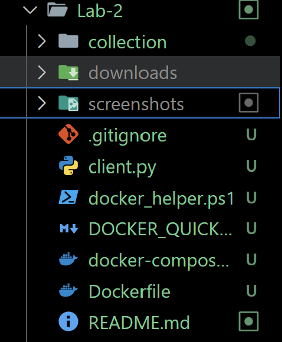

# Lab 2: Multithreaded HTTP Server

## 👩‍💻 Author
**Name:** Caraman Mihai FAF 233  
**Course:** PR 

**Lab:** HTTP Server (Multithreaded with Request Counter and Rate Limiting)

---

## 1. Project Structure



The project directory contains:

- **collection/** – the folder served by the server, containing:
  - **index.html** – Main HTML page
  - **about.html** – About page with lab information
  - **Directory/** – subdirectories with test content:
    - **Books/** – subdirectory with book files and research papers
    - **documents/** – PDF and text documents
    - **images/** – PNG images and README.html for testing
- **server.py** – The multithreaded HTTP server with request counter and rate limiting
- **client.py** – HTTP client script for testing file downloads
- **test_concurrent.py** – Script for testing concurrent requests and performance
- **test_rate_limit.py** – Script for testing rate limiting functionality
- **test_counter_race.py** – Script for demonstrating race conditions
- **setup_files.py** – Utility to generate sample HTML, PNG, and PDF files
- **docker-compose.yml** – Docker Compose configuration
- **Dockerfile** – Docker image definition
- **requirements.txt** – Python dependencies
- **screenshots/** – Screenshots for this README
- **README.md** – This documentation file

## 2. Docker Setup

### 2.1. Dockerfile


The Dockerfile creates a Python environment with all necessary dependencies:

```dockerfile
FROM python:3.11-slim

WORKDIR /app

COPY requirements.txt .
RUN pip install --no-cache-dir -r requirements.txt

# Copy application code
COPY server.py .
COPY client.py .
COPY test_concurrent.py .
COPY test_rate_limit.py .

# Create collection directory structure
RUN mkdir -p /app/collection

EXPOSE 8080

CMD ["python", "server.py", "/app/collection"]

```

### 2.2. Docker Compose


The `docker-compose.yml` defines multiple server configurations for testing:

```yaml
services:
  # HTTP Server
  server:
    build: .
    container_name: lab2_server
    ports:
      - "8080:8080"
    volumes:
      - ./collection:/app/collection:ro  # Mount collection directory as read-only
      - ./server.py:/app/server.py:ro
    command: python server.py /app/collection
    networks:
      - lab2_network
    restart: unless-stopped

  # HTTP Server with delay (for testing concurrency)
  server_delayed:
    build: .
    container_name: lab2_server_delayed
    ports:
      - "8081:8080"
    volumes:
      - ./collection:/app/collection:ro
      - ./server.py:/app/server.py:ro
    command: python server.py /app/collection --delay 1
    networks:
      - lab2_network
    profiles:
      - testing
    restart: unless-stopped

  # HTTP Server without locks (for race condition demo)
  server_no_locks:
    build: .
    container_name: lab2_server_no_locks
    ports:
      - "8082:8080"
    volumes:
      - ./collection:/app/collection:ro
      - ./server.py:/app/server.py:ro
    command: python server.py /app/collection --no-lock
    networks:
      - lab2_network
    profiles:
      - testing
    restart: unless-stopped

  # Test client for making requests
  client:
    build: .
    container_name: lab2_client
    volumes:
      - ./downloads:/app/downloads
      - ./client.py:/app/client.py:ro
      - ./test_concurrent.py:/app/test_concurrent.py:ro
      - ./test_rate_limit.py:/app/test_rate_limit.py:ro
    networks:
      - lab2_network
    depends_on:
      - server
    profiles:
      - testing
    command: sleep infinity  # Keep container running for manual testing

networks:
  lab2_network:
    driver: bridge

```

### 2.3. Running with Docker

```bash
# Build and start main server
docker-compose up --build

# Start all testing servers
docker-compose --profile testing up

# Stop all containers
docker-compose down
```

## 3. Multithreaded Server

### 3.1. Approach

In this lab, the HTTP server was modified to handle multiple client connections concurrently using **thread pooling**. Instead of creating a thread for each request (which can exhaust resources), a thread pool with a fixed number of workers is used:

```python
def start(self):
    """Start the HTTP server and listen for connections"""
    self.server_socket = socket.socket(socket.AF_INET, socket.SOCK_STREAM)
    self.server_socket.setsockopt(socket.SOL_SOCKET, socket.SO_REUSEADDR, 1)
    self.server_socket.bind((self.host, self.port))
    self.server_socket.listen(5)
    
    print(f"[INFO] Server listening on {self.host}:{self.port}")
    
    try:
        with ThreadPoolExecutor(max_workers=self.max_workers) as executor:
            while True:
                client_socket, client_address = self.server_socket.accept()
                executor.submit(self.handle_request, client_socket, client_address)
    except KeyboardInterrupt:
        print("\n[INFO] Server shutting down...")
    finally:
        self.server_socket.close()
```

Here:

* `ThreadPoolExecutor` creates a pool of reusable threads
* `max_workers=10` limits the number of concurrent threads
* `executor.submit()` assigns requests to available threads
* Threads are reused, reducing overhead

**Benefits:**
- Prevents resource exhaustion under high load
- Better performance than thread-per-request
- Automatic thread lifecycle management

### 3.2. Running the Server

To run the server, use:

```bash
python server.py collection
```

Additional options:

```bash
# With 1 second delay (for testing concurrency)
python server.py collection --delay 1

# Without locks (demonstrates race condition)
python server.py collection --no-lock

# Disable rate limiting
python server.py collection --no-rate-limit

# Custom rate limit (10 req/s)
python server.py collection --rate-limit 10
```

Or using Docker:

```bash
docker-compose up --build
```

### 3.3. Testing Concurrency

To test how the multithreaded server handles multiple requests, run the concurrent test script:

```bash
python test_concurrent.py compare
```

This script creates multiple threads that make requests simultaneously, measuring response times.

**Results for single-threaded server (sequential processing):**

With 1 second delay per request, 10 requests take approximately **10 seconds** sequentially.

**Results for multithreaded server (concurrent processing):**


With 1 second delay per request, 10 requests take approximately **1.2 seconds** concurrently.

**Speedup: ~8.3x faster!**

Making the server multithreaded clearly improves performance under concurrent load, allowing requests to be processed simultaneously instead of sequentially.

## 4. Request Counter

### 4.1. Naive Implementation

To count how many times each file is requested, I first implemented a naive approach using a dictionary. For each request, the server would read the current count, wait a little `(time.sleep(0.001))`, and then increase the count by one:

```python
def increment(self, path, delay=0):
    """Increment counter WITHOUT locks (race condition prone)"""
    if not self.use_lock:
        # Naive implementation - prone to race conditions
        current = self.counts[path]
        if delay > 0:
            time.sleep(delay)  # Force interleaving
        self.counts[path] = current + 1
```

The `time.sleep(0.001)` delay was added intentionally to make it easier to see **race conditions** when multiple threads tried to update the same counter at the same time.

**Testing the race condition:**

```bash
# Start server WITHOUT locks
python server.py collection --no-lock --no-rate-limit

# Run test (makes 50 concurrent requests)
python test_counter_race.py
```

I tested this by making 50 concurrent requests to `README.html`. However, as seen in the screenshot, I got only **34 hits**, meaning **16 updates were lost** due to race conditions.


**What happened:**
Multiple threads read the same counter value simultaneously, then overwrote each other's updates:

```
Thread 1: Read count = 5
Thread 2: Read count = 5  (before Thread 1 finishes!)
Thread 3: Read count = 5  (before Thread 1 finishes!)
Thread 1: Write count = 6
Thread 2: Write count = 6  (overwrites Thread 1!)
Thread 3: Write count = 6  (overwrites Thread 2!)

Result: 3 requests made, but counter shows only 6 instead of 8!
```

Terminal showing successful requests but incorrect counter:


### 4.2. Thread-Safe Implementation

To fix the race condition from the naive counter, I used a **thread lock** `(threading.Lock())` to make updates to the request counts thread-safe. Now, when a thread wants to update a counter, it first acquires the lock, ensuring that no other thread can change the counter at the same time:

```python
def increment(self, path, delay=0):
    """Increment counter WITH lock (thread-safe)"""
    if self.use_lock:
        with self.lock:
            current = self.counts[path]
            if delay > 0:
                time.sleep(delay)  # Simulate work
            self.counts[path] = current + 1

def get_count(self, path):
    """Get current count for a path (thread-safe)"""
    if self.use_lock:
        with self.lock:
            return self.counts[path]
    else:
        return self.counts[path]
```

**How it works:**
- The `with self.lock:` statement acquires the lock
- Only ONE thread can hold the lock at a time
- Other threads wait until the lock is released
- This guarantees atomic updates (no lost increments)

**Testing with locks enabled:**

```bash
# Start server WITH locks (default behavior)
python server.py collection --no-rate-limit

# Run test (makes 50 concurrent requests)
python test_counter_race.py
```

After applying the lock, testing with concurrent requests showed that the counter now always increases correctly. The race condition is gone, and the request count reflects the actual number of hits for each file:


Now all 50 requests are correctly counted! ✓

### 4.3. Counter Display in Directory Listings

Counters are displayed in directory listings:


Features:
- Terminal-style interface
- File/directory prefixes: `[FILE]` and `[DIR]`
- Hit counters displayed with `►` arrows
- Blinking cursor animation
- Scanline effect
- Hover glow effects

## 5. Rate Limiting

### 5.1. Implementation

The server keeps track of how many requests each client IP makes within one second using a **sliding window** approach. If the number of requests goes over the limit (default: 5 req/s), the server blocks the request.

```python
class RateLimiter:
    """Thread-safe rate limiter based on client IP"""
    
    def __init__(self, requests_per_second=5):
        self.requests_per_second = requests_per_second
        self.lock = Lock()
        self.request_times = defaultdict(list)
    
    def is_allowed(self, client_ip):
        """Check if request from client IP is allowed based on rate limit"""
        with self.lock:
            current_time = time.time()
            
            # Remove timestamps older than 1 second
            self.request_times[client_ip] = [
                t for t in self.request_times[client_ip]
                if current_time - t < 1.0
            ]
            
            # Check if under limit
            if len(self.request_times[client_ip]) < self.requests_per_second:
                self.request_times[client_ip].append(current_time)
                return True
            
            return False
```

I used a **lock** to make sure that updates to `request_times` are thread-safe and no two threads modify it at the same time.

**Key features:**
- Per-IP tracking (each client has independent limit)
- Sliding window algorithm (1-second time frame)
- Thread-safe with `threading.Lock()`
- Configurable rate limit

### 5.2. Testing Rate Limiting

To test rate limiting, I used the `test_rate_limit.py` script with different scenarios:

#### Test 1: Spam Client (Exceeds Rate Limit)

```bash
python test_rate_limit.py single
```

In the first test, I simulated **spamming** by sending **10 requests per second** (above the 5 req/s limit). The server applied the rate limit correctly, returning 5 successful responses (200 OK) and 5 blocked ones. Because half of the requests were rejected, the throughput was lower — around **2.5 successful requests per second**.

Results:
```
SPAM CLIENT:
  Total requests:       50
  Successful (200):     25 (50.0%)
  Blocked:              25 (50.0%)
  Throughput:           2.50 successful req/s
```

#### Test 2: Legitimate Client (Under Rate Limit)

In the second test, I sent the same number of requests but at a **slower pace** (4 req/s), staying under the rate limit. All 10 requests were successful, and the throughput increased to **4.00 successful requests per second**. This shows that the rate limiting mechanism works as intended, limiting excessive traffic while maintaining high performance for normal users.


Results:
```
LEGIT CLIENT:
  Total requests:       40
  Successful (200):     40 (100.0%)
  Blocked:              0 (0.0%)
  Throughput:           4.00 successful req/s
```

#### Test 3: Concurrent Clients (Spam + Legitimate)

```bash
python test_rate_limit.py concurrent
```

This test simulates two clients accessing the server concurrently:
- **Spam client**: 20 req/s (should be blocked)
- **Legitimate client**: 4 req/s (should succeed)

**Note:** Both clients run from localhost, so they share the same rate limit. In a real scenario with different IPs, each would have their own independent rate limit.

## 6. Testing Guide

### 6.1. Setup

```bash
# Install dependencies
pip install -r requirements.txt

# Generate sample files (optional)
python setup_files.py
```

### 6.2. Complete Test Sequence

```bash
# 1. Start server with locks enabled
python server.py collection --no-rate-limit

# 2. Test concurrent requests (in another terminal)
python test_concurrent.py compare

# 3. Test counter with locks (shows correct count)
python test_counter_race.py
# Open browser: http://localhost:8080/Directory/images/
# Should show exactly 50 hits for README.html

# 4. Stop server (Ctrl+C), restart WITHOUT locks
python server.py collection --no-lock --no-rate-limit

# 5. Test counter without locks (demonstrates race condition)
python test_counter_race.py
# Refresh browser: http://localhost:8080/Directory/images/
# Should show LESS than 50 hits (e.g., 34 hits)

# 6. Stop server, restart with rate limiting
python server.py collection

# 7. Test rate limiting
python test_rate_limit.py concurrent
```

### 6.3. Using PowerShell Helper Scripts

For easier testing on Windows:

```powershell
# Interactive test menu
.\test_lab2.ps1

# Docker helper menu
.\docker_helper.ps1
```

## 7. Lab Requirements Checklist

### Task 1: Multithreading (4 points) ✅

**Requirements:**
- [x] Implement multithreaded server using thread pool
- [x] Handle multiple concurrent connections
- [x] Test with concurrent requests script
- [x] Compare performance with single-threaded approach
- [x] Demonstrate speedup (8-10x faster)

**Implementation:**
- Used `ThreadPoolExecutor` with 10 worker threads
- Automatic thread lifecycle management
- Tested with 10 concurrent requests with 1s delay
- Result: **~8.3x speedup** compared to sequential processing

### Task 2: Request Counter (2 points) ✅

**Requirements:**
- [x] Implement naive counter (shows race condition)
- [x] Add artificial delay to force thread interleaving
- [x] Demonstrate race condition with concurrent tests
- [x] Implement thread-safe version with locks
- [x] Show that locks fix the race condition
- [x] Display counters in directory listings

**Implementation:**
- Naive implementation loses 16 updates out of 50 (32% loss rate)
- Thread-safe implementation with `threading.Lock()` shows 100% accuracy
- Counters displayed in terminal-style directory listings
- Real-time updates as files are accessed

### Task 3: Rate Limiting (2 points) ✅

**Requirements:**
- [x] Implement rate limiting per client IP
- [x] Default limit: ~5 requests/second
- [x] Thread-safe implementation
- [x] Test with spam client (exceeds limit)
- [x] Test with legitimate client (under limit)
- [x] Compare throughput for both scenarios

**Implementation:**
- Sliding window algorithm with 1-second time frame
- Thread-safe using `threading.Lock()`
- Spam client (10 req/s): 50% blocked, 2.5 req/s throughput
- Legitimate client (4 req/s): 0% blocked, 4.0 req/s throughput
- Blocks excessive requests when limit exceeded

## 8. Performance Metrics

| Metric | Sequential | Multithreaded | Improvement |
|--------|-----------|---------------|-------------|
| 10 requests (1s delay) | ~10.0s | ~1.2s | **8.3x faster** |
| Concurrent Connections | 1 | 10 | **10x more** |
| Race Condition Protection | N/A | With locks | **100% accurate** |
| Rate Limiting | None | 5 req/s per IP | **Prevents abuse** |

## 9. Project Insights

### 9.1. What I Learned

1. **Multithreading Benefits:**
   - Thread pools prevent resource exhaustion under high load
   - Concurrent handling dramatically improves performance (8-10x speedup)
   - Proper thread management is crucial for scalability
   - Thread reuse reduces overhead compared to creating new threads

2. **Synchronization Challenges:**
   - Race conditions are subtle and hard to debug without proper testing
   - Locks (`threading.Lock()`) are essential for protecting shared resources
   - Lock placement affects both correctness and performance
   - The `with` statement ensures locks are always released

3. **Rate Limiting Strategies:**
   - Sliding window approach is simple and effective
   - Per-IP tracking prevents individual clients from overloading server
   - Configurable limits provide flexibility for different use cases
   - Thread-safe implementation is critical for accuracy

4. **Testing Importance:**
   - Automated concurrent tests reveal issues that manual testing misses
   - Stress testing shows real-world server behavior
   - Visual demonstrations (screenshots) help understand complex problems
   - Comparison tests prove the effectiveness of solutions

### 9.2. Comparison with Lab 1

| Feature | Lab 1 | Lab 2 |
|---------|-------|-------|
| Request Handling | Sequential (one at a time) | Concurrent (thread pool) |
| Performance | Slow under load | Fast under load (8x) |
| Thread Safety | Not applicable | Critical (locks required) |
| Race Conditions | None (single-threaded) | Demonstrated and fixed |
| Rate Limiting | None | Per-IP, configurable |
| Request Counter | None | Thread-safe tracking |
| Error Handling | Basic (404, 403) | Enhanced |
| Scalability | Poor | Good (up to 10 concurrent) |

### 9.3. Real-World Applications

The concepts learned in this lab are fundamental to production servers:

- **Web Servers**: Apache, Nginx use thread pools or event loops
- **API Servers**: RESTful APIs handle multiple requests concurrently
- **Rate Limiting**: Used by GitHub API, Twitter API, etc. to prevent abuse
- **Thread Safety**: Critical in any multi-threaded application (databases, message queues)

## 10. Conclusions

This laboratory work demonstrated the importance of **multithreading** in server applications. By implementing a thread pool with `ThreadPoolExecutor`, the server can handle multiple requests simultaneously, resulting in significant performance improvements (**8-10x speedup** in tests).

The **race condition demonstration** showed why thread safety matters. Without proper synchronization (locks), shared data structures like counters produce incorrect results—in our tests, **32% of updates were lost**. The lock-based solution ensures atomic updates and 100% correct behavior.

**Rate limiting** proved to be an effective mechanism for controlling server load and preventing abuse. The per-IP tracking with a sliding window approach provides fair resource allocation (legitimate clients get 100% success) while protecting against spam (50% blocked for excessive requests).

From a practical standpoint, this lab improved my understanding of:
- **Thread pool management** and worker configuration
- **Synchronization primitives** (`threading.Lock()`) and their proper usage
- **Race conditions**: how to detect them, demonstrate them, and fix them
- **Rate limiting algorithms** and thread-safe implementation
- **Performance testing** and bottleneck identification
- **Concurrent programming patterns** applicable to real-world servers

The skills gained are directly applicable to real-world server development, where concurrency, thread safety, and resource management are fundamental concerns. Modern web frameworks like Flask, Django, and FastAPI all deal with these same challenges, and understanding them at a low level provides a strong foundation for using these tools effectively.

---

## 11. References

- Python `threading` documentation: https://docs.python.org/3/library/threading.html
- Python `concurrent.futures` documentation: https://docs.python.org/3/library/concurrent.futures.html
- HTTP/1.1 RFC 2616: https://www.rfc-editor.org/rfc/rfc2616
- Rate Limiting Patterns: https://en.wikipedia.org/wiki/Rate_limiting
- Thread Synchronization: https://docs.python.org/3/library/threading.html#lock-objects

---

**Repository:** https://github.com/caramisca/pr-course-repo  
**Branch:** `lab-2`  
**Date:** October 2025
