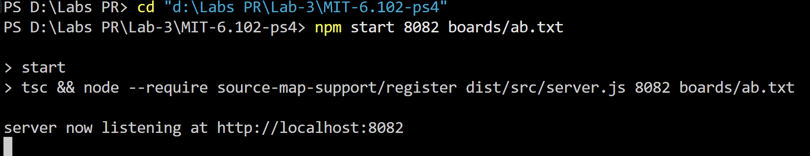
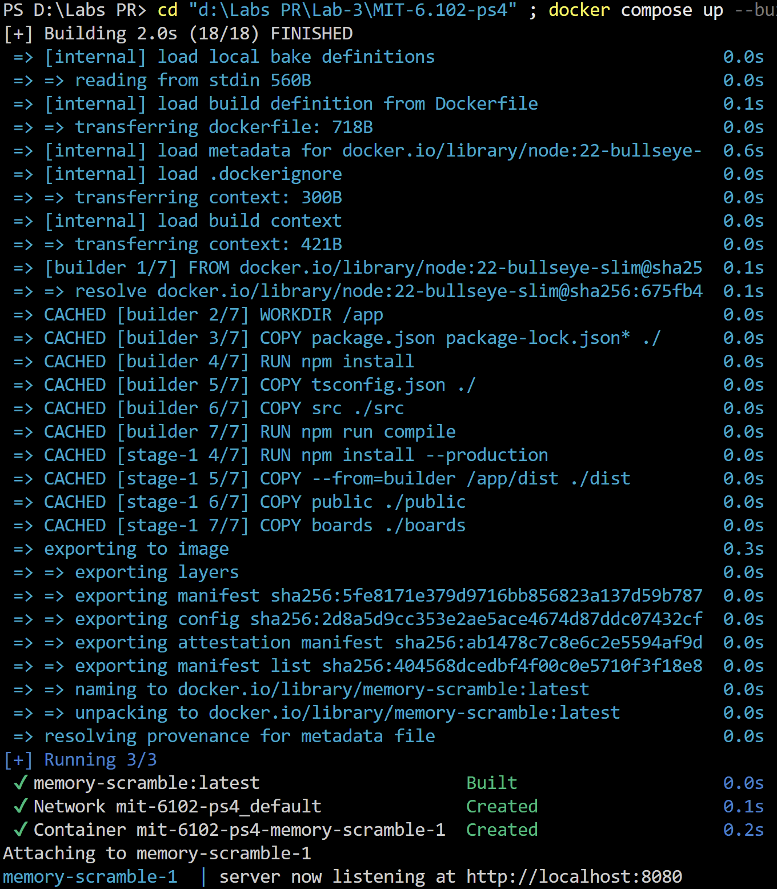
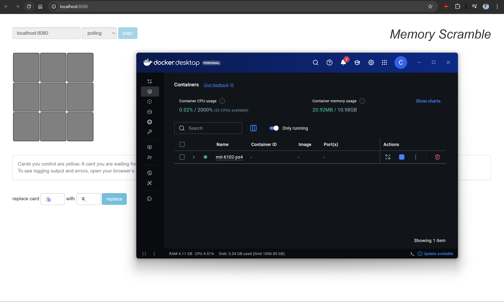
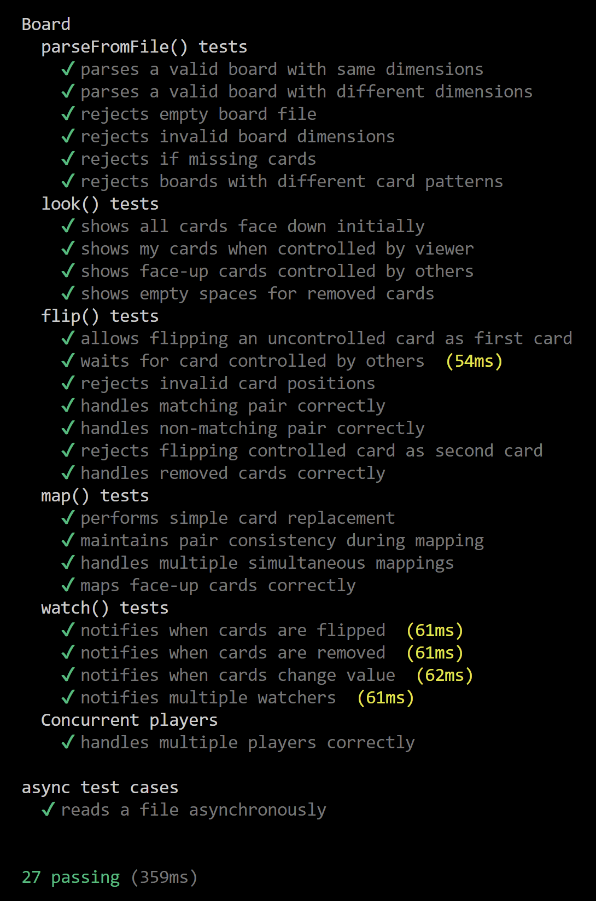
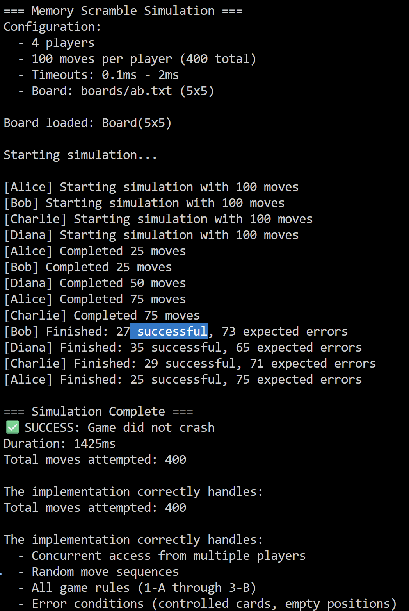

# PR Lab 3 - MIT 6.102 (2025) Memory Scramble

**Student:** Caraman Mihai, FAF-233  
**Course:** Network Programming (PR)  
**Instructor:** Artiom Balan  
**Deadline:** Nov 11, 2025  
**Repository:** [GitHub Link](https://github.com/caramisca/pr-course-repo)

---

## 1. Overview

This lab implements the backend for the "Memory Scramble" game based on MIT 6.102 PS4 specifications. The server provides a concurrent, thread-safe `Board` Abstract Data Type (ADT) that works with an HTTP API used by the provided frontend (`public/index.html`). The implementation focuses on:

- **Correct game semantics** following strict rules for card flipping and matching
- **Concurrency safety** with FIFO queuing to prevent race conditions
- **Fair access control** preventing spam-clicking exploits
- **Real-time updates** using watch notifications for live gameplay

The code provided for: [https://web.mit.edu/6.102/www/sp25/psets/ps4](https://web.mit.edu/6.102/www/sp25/psets/ps4)

## 2. Objectives

1. **Board ADT:** Implement parsing, validation and the core operations (look/flip/map/watch) with correct semantics.
2. **Concurrency safety:** Ensure the server behaves correctly when multiple players interact concurrently using FIFO queuing.
3. **Testing & tooling:** Provide comprehensive unit tests, simulation, and linting to ensure correctness and maintainability.
4. **Fair access control:** Implement single-wait pattern to prevent spam-clicking exploits while maintaining fair player access.
5. **Real-time updates:** Design watch notification system for live gameplay experience.

---

## 3. Project Structure

```
Lab-3/
├── Dockerfile                  # Docker image configuration
├── docker-compose.yml          # Docker Compose setup
├── package.json
├── tsconfig.json
├── eslint.config.mjs
├── public/                     # Frontend UI (single static HTML file)
│   └── index.html
├── boards/                     # Example board files used in tests and demo
│   ├── perfect.txt            # 4x4 board with 8 pairs
│   ├── ab.txt                 # Simple 2x1 board
│   └── zoom.txt               # 6x6 board
├── src/
│   ├── board.ts               # Board ADT implementation (507 lines)
│   ├── commands.ts            # API wrappers (look/flip/map/watch)
│   ├── server.ts              # Express web server
│   └── simulation.ts          # 4-player concurrent simulation
├── dist/                      # Compiled output (generated)
├── test/
│   └── board.test.ts          # 27 comprehensive unit tests
└── screenshots/               # Documentation screenshots
    ├── server_startup.png     # Server running locally
    ├── docker_startup.png     # Docker container startup
    ├── docker_test.png        # Accessing server via Docker
    ├── unit_tests.png         # Test results
    └── simulation.png         # Simulation results
```

## 4. Running Locally

### Prerequisites

- Node.js 22+ and npm

### Install and start

```bash
npm install
npm start 0 boards/perfect.txt
```

After startup, the server will choose a random available port and you will be able to access the UI by opening `public/index.html` and entering the connection credentials in format `ip:port` at the input box, where `ip` is the IP address of the machine running the server instance and `port` is the port chosen by server.

### Environment/config options
The server accepts two positional CLI arguments: `PORT` (use 0 for random) and `FILENAME` (path to board file).

### Screenshot – starting the server locally



---

## 4.5. Docker Setup

This repository includes a `Dockerfile` and `docker-compose.yml` for quick containerized deployment.

### Dockerfile

The Dockerfile uses a multi-stage build to create an optimized production image:

```dockerfile
FROM node:22-bullseye-slim AS builder

WORKDIR /app

# Install dependencies
COPY package.json package-lock.json* ./
RUN npm install

# Copy source and build
COPY . .
RUN npm run compile

# Runtime image: install only production deps
FROM node:22-bullseye-slim
WORKDIR /app
COPY package.json package-lock.json* ./
RUN npm install --production

# Copy built artifacts and static assets
COPY --from=builder /app/dist ./dist
COPY --from=builder /app/public ./public
COPY --from=builder /app/boards ./boards

EXPOSE 8080

CMD ["node", "dist/server.js", "8080", "boards/perfect.txt"]
```

**Note:** TypeScript compiles files directly to `dist/` (e.g., `dist/server.js`), not to `dist/src/`.

### docker-compose.yml

```yaml
services:
  memory-scramble:
    build: .
    image: memory-scramble:latest
    ports:
      - "8080:8080"
    restart: unless-stopped
```

### Build and run with Docker Compose

```bash
docker compose up --build
```

By default the container will listen on port `8080` and load `boards/perfect.txt`.

If you prefer to override the command in Compose, you can modify the `docker-compose.yml`:

```yaml
command: ["node", "dist/server.js", "8080", "boards/ab.txt"]
```

### Screenshot – Docker container startup


*Docker container builds and starts successfully*

### Screenshot – Accessing the server via Docker


*Accessing the game via `localhost:8080` in the browser*

---

## 5. Board ADT Design

The `Board ADT` consists of several components that together implement the Memory Scramble game: types, helper classes, and the main board ADT.

### Components
* **`Spot`:** Represents a card on the board, including its value, whether it is face up, and which player (if any) currently controls it.
* **`PlayerState`:** Represents a player's game state, tracking the cards they have flipped this turn (if they flipped any), and whether they have found a match.
* **`Promise.withResolvers()`:** Modern JavaScript API used for creating promises with exposed resolve/reject functions. Used to handle players waiting to flip cards controlled by others, allowing safe asynchronous interactions with FIFO queuing.

### Main Board ADT - `Board`
#### Abstraction Function (AF):
The board represents a `rows × columns` grid of cards. Each cell may contain a card or be empty. For each spot:

* `card` is the card's string value, or null if removed.
* `faceUp` indicates whether the card is visible.
* `controller` shows the player currently controlling the card, or null if uncontrolled.

Players are tracked in the `players` map:

* `firstCard` and `secondCard` store the positions of cards flipped this turn.
* `matched` indicates if the player found a matching pair.
* `watchers` stores functions to call when the board state changes. These callbacks represent "watching" players.
* `waitingForCard` stores FIFO queues of players waiting to flip specific cards that are currently controlled by other players.

#### Representation Invariant (RI):

* The grid matches the declared `rows` and `columns`.
* Removed cards are always face-down and uncontrolled.
* Controlled cards are always face-up and have a value.
* Each player controls at most two cards.
* Player states are consistent with the grid.
* All spot values are defined (never undefined).
* FIFO queues ensure fair access to controlled cards.

#### Safety from Representation Exposure:

* All fields are private and readonly.
* Internal mutable structures are never returned directly.
* Methods return strings (board state) or primitives only.
* `checkRep()` validates the RI after every modification.

---

## 6. Core Operations

The Board ADT provides several public methods that define how players interact with the game and how the board state can be manipulated. These core operations handle all the game rules, enforce concurrency safety, and ensure a consistent state.

### 1. `parseFromFile(filename: string): Promise<Board>` 

Loads a board layout from a file and validates its structure. It ensures the first line specifies the board dimensions in `ROWxCOLUMN` format, and each subsequent line contains valid card values. This method constructs a new Board instance with a deep copy of the grid and calls `checkRep()` to verify the representation invariants.

### 2. `flip(playerId: string, row: number, column: number): Promise<string>`

    The main operation for player interaction. When a player flips a card, the Board ensures that:

    * Any unfinished turn from the same player is completed first, by calling `finishPreviousPlay()`, which flips back unmatched cards or removes matched pairs (Rule 3).
    * Depending on whether this is the player's first or second card of the turn, `flipFirstCard()` or `flipSecondCard()` is called. These helpers handle the detailed logic of flipping, checking for matches, and enforcing the rules.
    * If a card is already controlled by another player, the player waits asynchronously using **FIFO queuing** until the card becomes available (Rule 1-D with fair access).
    * Once the flip logic completes, `notifyWatchers()` notifies any players watching the board of the update.

This method maintains concurrency safety, allowing multiple players to interact with the board simultaneously without corrupting the state. The **single-wait pattern** prevents spam-clicking exploits.

### 3. `look(playerId: string): Promise<string>`

Generates a player-specific string representation of the board. Cards are shown differently depending on whether they are face down, controlled by the player, or visible but controlled by another player. This method provides a consistent view of the board without exposing the internal mutable state.

### 4. `map(playerId: string, f: (card: string) => Promise<string>): Promise<string>`

Applies an asynchronous function to transform the values of all cards on the board. Each unique card value is mapped once, and the results are applied back to the board **atomically** to maintain pairwise consistency. During this operation, other player actions can still occur, ensuring that the game remains concurrent. Once mapping is complete, `notifyWatchers()` is called to notify watchers, and `checkRep()` ensures the board remains in a valid state.

### 5. `watch(playerId: string): Promise<string>`

Allows a player to wait for the next board change. When a change occurs, the promise resolves, giving the player an updated view. Internally, this method registers a callback in `watchers`, which is triggered by any operation that modifies the board.

---

## 7. Tests and Simulation


### Run unit tests

```bash
cd 'd:\Labs PR\Lab-3\' ; npx mocha --require source-map-support/register dist/test/**/*.js 
```

The testing strategy for the Board module focuses on verifying that the game behaves correctly under all conditions described in the specification, including input validation, gameplay logic, state transitions, and concurrency handling.

### Test Approach
Tests are designed to check multiple aspects of the Board:

* **Input validation:** ensuring that malformed files, invalid dimensions, and missing cards are rejected by `parseFromFile()`.
* **Gameplay logic:** verifying that flipping cards, matching pairs, relinquishing control, and removing cards follow the rules.
* **State transitions:** confirming that cards change state appropriately between `down`, `card`, `my:card`, and `empty`, and that cleanup after each turn is correct.
* **Concurrency and waiting behavior:** testing that multiple players interacting with the same card are handled safely using FIFO queues with fair access control.
* **Transformations:** ensuring that `map()` correctly applies asynchronous functions to card values without breaking game logic, maintaining pairwise consistency.
* **Player-specific views:** `look()` tests confirm that each player sees cards from their own perspective, respecting control and visibility rules.
* **Notifications:** `watch()` tests verify that players are notified of board changes, including flips, removals, and transformations.

### Organization
Tests are grouped by the functionality they target:

1. **parseFromFile:** checks valid board loading, invalid dimensions, empty cells, and card counts (6 tests).
2. **look():** validates the view of cards for a single player under different states (4 tests).
3. **flip():** ensures all game rules are enforced correctly (7 tests covering Rules 1-A through 3-B).
4. **map():** ensures asynchronous transformations of card values, pairwise consistency, and proper notification behavior (4 tests).
5. **watch():** tests notification delivery for flips, removals, and map transformations (4 tests).
6. **Concurrent players:** verifies that multiple players can interact safely with the board simultaneously (2 tests).

All **27 tests** in this suite are passing, confirming that the Board module behaves according to the specification and that its operations are correctly implemented and concurrency-safe.

### Screenshot – unit tests result




---

### Run the simulation script

```bash
npm run simulation
```

### Screenshot – simulation results


*4 players (Alice, Bob, Charlie, Diana) completing 400 concurrent moves successfully*

## 8. Simulation

The simulation demonstrates multiple players interacting concurrently with the Board. Four players (Alice, Bob, Charlie, Diana) attempt 100 moves each on a 5x5 board, with random delays (0.1ms - 2ms) between flips to mimic real gameplay. Each player flips two cards per turn, waiting if a card is controlled by another player or invalid.

The purpose of the simulation is to verify that the game never crashes under concurrent actions(and it doesnot). At the end, the final board state is displayed, and each player's statistics (`successful moves`, `errors`, and `duration`) are reported. This confirms that the Board enforces game rules, handles concurrency safely with FIFO queuing, and maintains a consistent state throughout.

---

## 9. Quick Reference


### Key Components

| Component | Purpose |
|---|---|
| `src/board.ts` | Core ADT implementing the game board and game rules (parsing, state management, concurrency control). |
| `src/commands.ts` | Thin wrappers used by the server and simulation for look/flip/map/watch operations. |
| `src/server.ts` | Express server exposing the HTTP API used by the frontend. |
| `src/simulation.ts` | 4-player concurrent simulation script for testing realistic gameplay scenarios. |
| `public/index.html` | Reference front-end UI for playing the game. |
| `boards/` | Example board files (perfect.txt, ab.txt, zoom.txt) used by tests and demos. |
| `test/board.test.ts` | 27 comprehensive Mocha tests for the Board ADT and its operations. |
| `Dockerfile` | Multi-stage Docker build configuration for production deployment. |
| `docker-compose.yml` | Docker Compose orchestration file. |

---


**Key implementation highlights:**
- FIFO queuing prevents race conditions
- Single-wait pattern prevents spam-clicking exploits
- Atomic map operations maintain pairwise consistency
- Watch notifications enable real-time gameplay
- Multi-stage Docker build for optimized production image

---

## 10. Conclusion
Working on the Memory Scramble board project taught me a lot about handling concurrent systems. I learned how to make sure that multiple players can interact with the board at the same time without breaking the game state. I also got better at using abstract data types and helper classes, and at keeping the design clear with representation invariants and abstraction functions.

Writing the tests helped me think carefully about edge cases, asynchronous behavior, and making sure all the game rules are followed. The FIFO queuing mechanism was particularly important for preventing spam-clicking exploits and ensuring fair access to controlled cards. Running the simulation showed me how concurrency works in practice and confirmed that the game can handle multiple players safely.

Overall, this project helped me improve my skills in designing safe and reliable software. It will definitely help me in future projects where I need to manage shared state, reason about correctness, and write code that works well even in complex scenarios.
